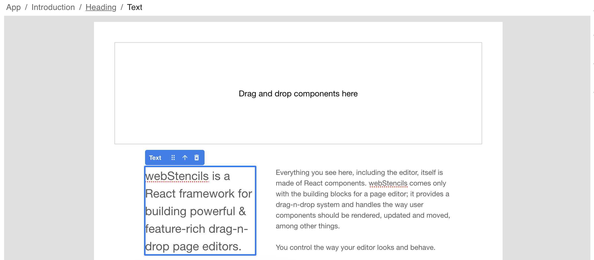

# <Breadcrumbs \/>

`Component`, `@webstencils/ui`

Specialised breadcrumbs component to display a layout path to the selected element.

```jsx
import { Editor } from '@webstencils/core';
import { Breadcrumbs } from '@webstencils/ui';

function MyComponent() {
  return (
    <Editor>
      <Breadcrumbs />
      <Frame>{/* ... */}</Frame>
    </Editor>
  )
}
```

Let's take the following layout as an example:

```jsx
<App>
  <Introduction>
    <Heading>
      <Text></Text>
    </Heading>
  </Introduction>
</App>
```

When clicking on the `Text` element, you are going to see the following structure:



Clicking on each link of the breadcrumb selects the corresponding component.
