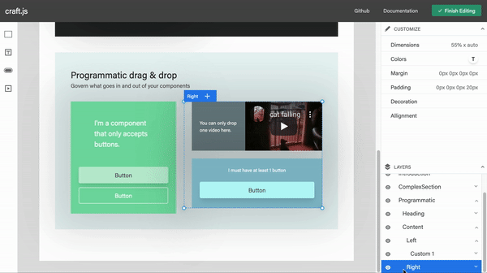

# @webstencils/layers

A Photoshop-like layers panel for your page editor.



- [Documentation](https://denysvuika.github.io/handicraft/additional/layers)

## Usage

```bash
yarn add @webstencils/layers styled-components
```

```jsx
import React from "react";
import { Editor } from "@webstencils/core";
import { Layers } from "@webstencils/layers";

export default function App() {
  return (
    <div style={{margin: "0 auto", width: "800px"}}>
      <Typography variant="h5" align="center">A super simple page editor</Typography>
      <Editor resolver={/*...*/}>
        <Layers />
      </Editor>
    </div>
  );
}
```
